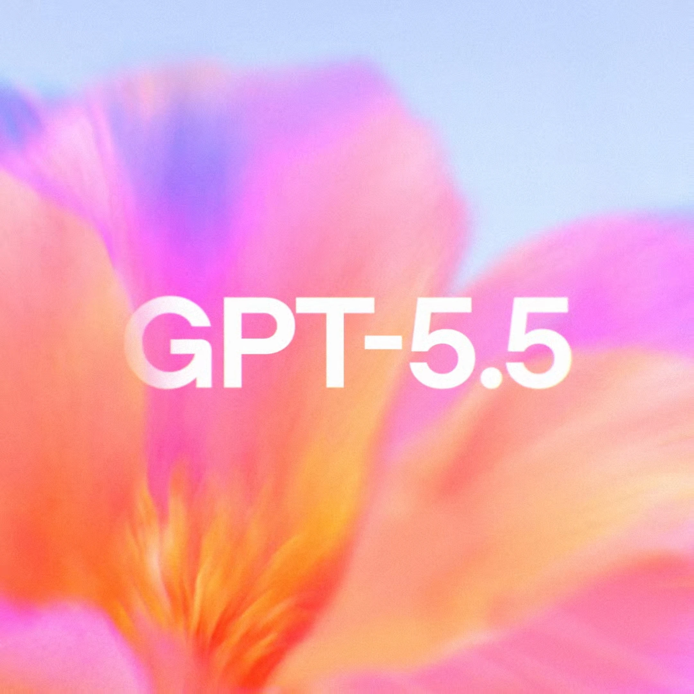
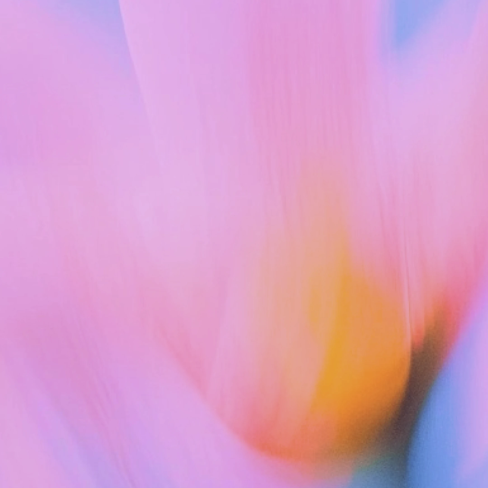
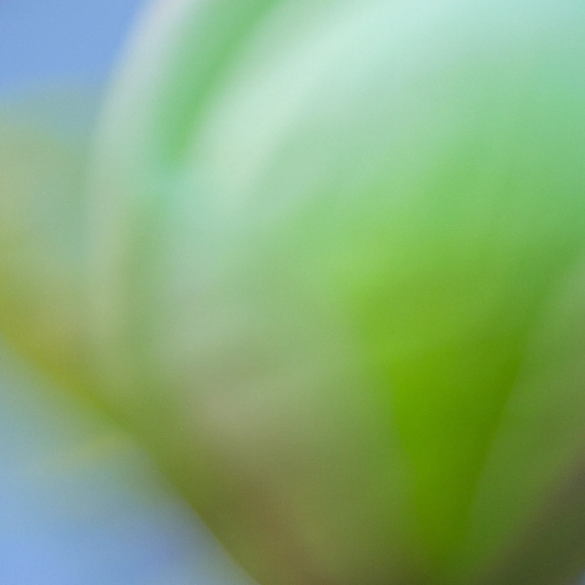
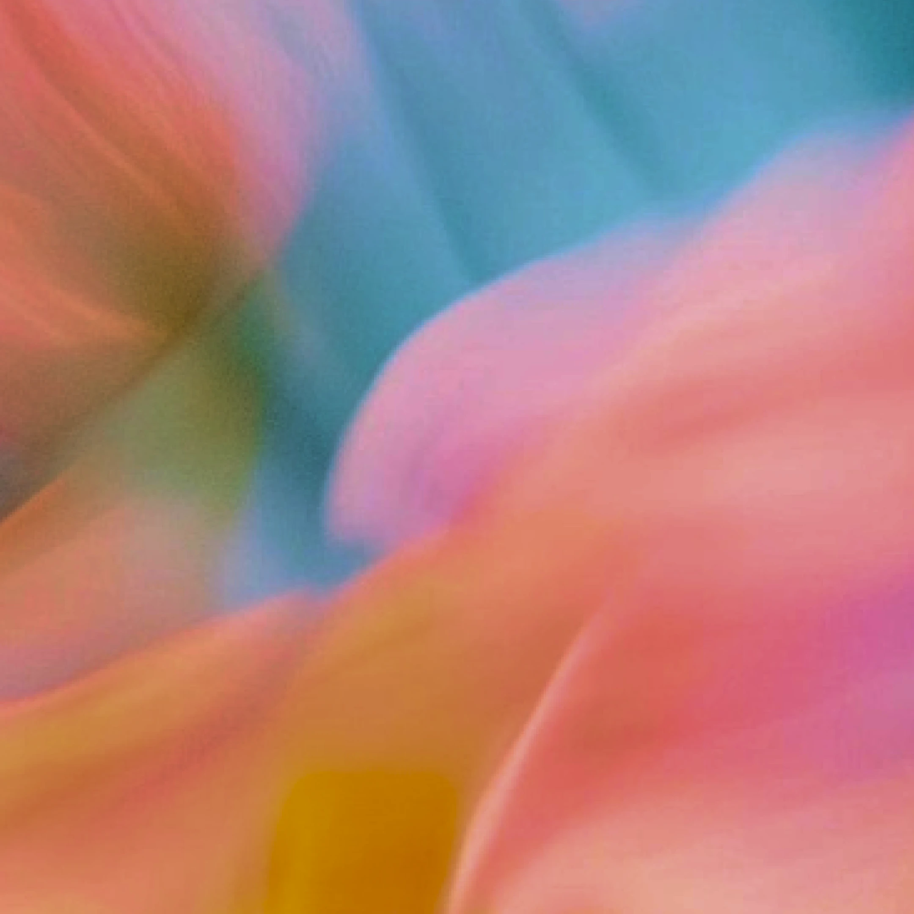
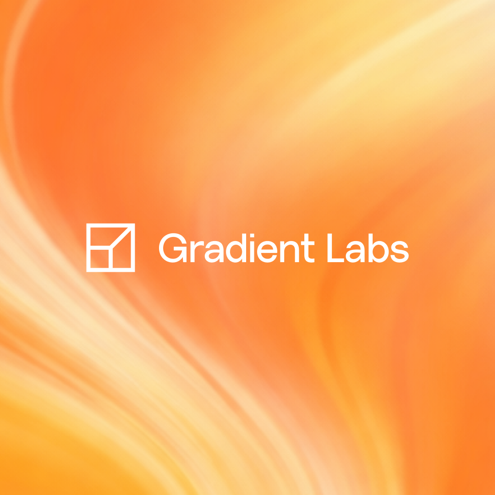
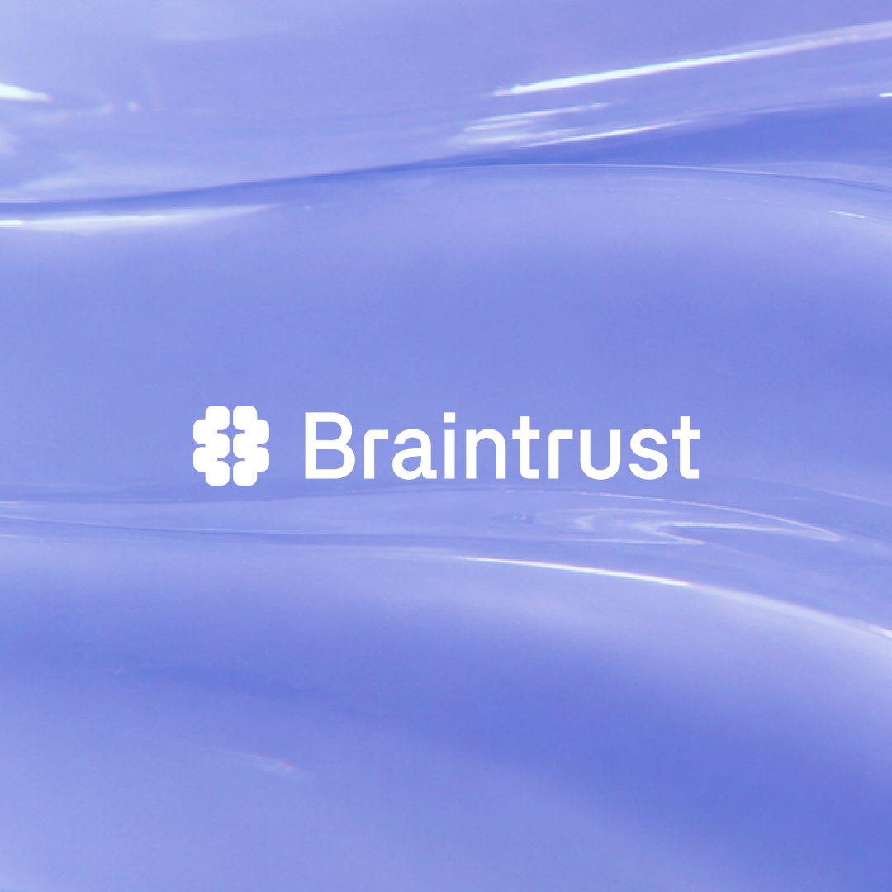
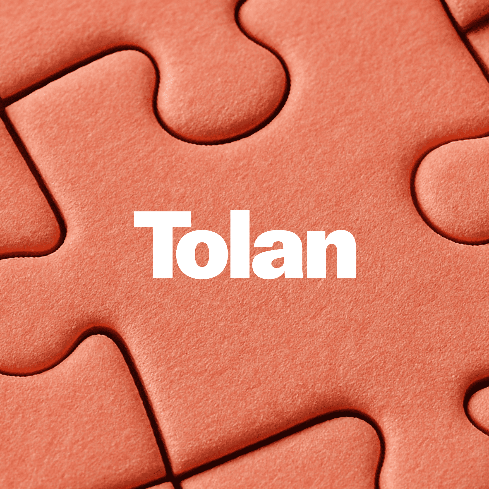
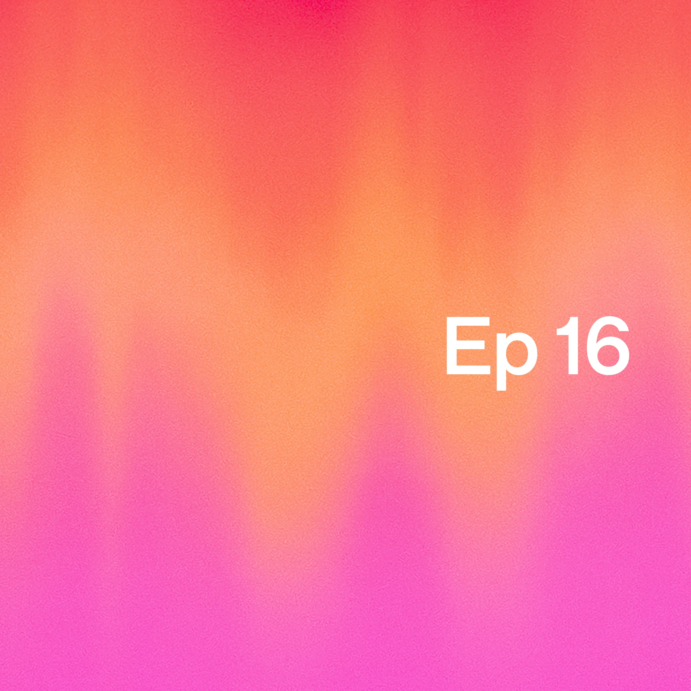
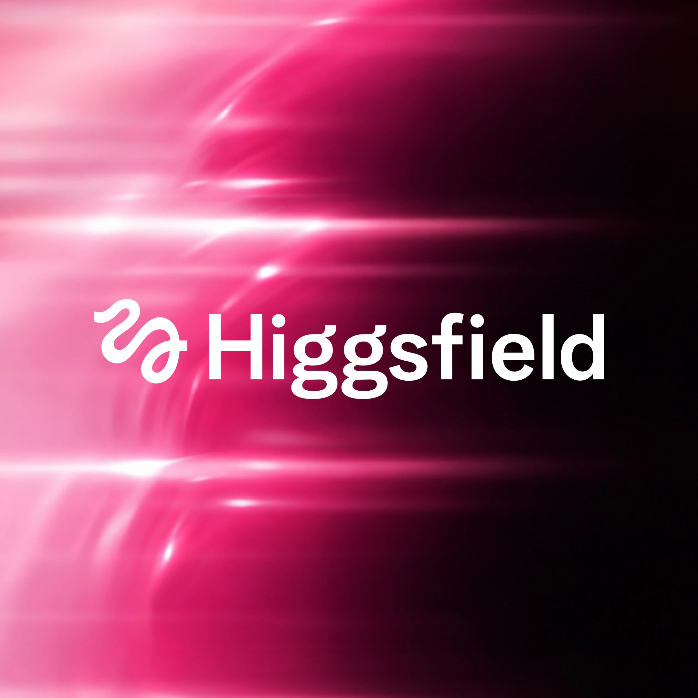

# OpenAI 圖片生成提示詞規格書 (Prompt Library)

本文件整理了專案中各類卡片背景與風格的來源圖片、提示詞 (Prompt) 及其視覺特徵。可用作 Canvas 渲染演算法與漸層設計的對照參考。

---

## 快速索引表 (Index)

| 預覽圖名稱 | 主要色系與特徵 | 建議對應 Presets |
| :--- | :--- | :--- |
| **[Hero_Art_Card_SEO_1x1](#1-hero-art-card-seo-1x1)** | 暖粉與橘色、柔焦花卉 | 封面 (`article`) |
| **[Art_Card_1080x1080_1](#2-art_card_1080x1080_1)** | 藍色系、斜向線條與光斑 | 柔光 (`diffusion`) |
| **[ArtCard-Trusted-Contact](#3-artcard-trusted-contact)** | 淡粉與薰衣草紫、溫暖核心 | 柔光 (`diffusion`) / 質感 (`material`) |
| **[confidential-submission-draft](#4-confidential-submission-draft)** | 亮綠與翠綠、植物嫩芽 | 暖綠 (`warmflow`) |
| **[Saftey-Art-Card](#5-saftey-art-card)** | 珊瑚橘、桃紅與鴨綠色、流動形狀 | 彩虹 (`prism`) |
| **[oai_CyberAgent](#6-oai_cyberagent)** | 深綠與萊姆綠、發光流線 | 極光 (`aurora` - 科技版) |
| **[oai_GradientLabs](#7-oai_gradientlabs)** | 橘色到黃色漸層、動態光芒 | 日落 (`horizon`) |
| **[oai_braintrust](#8-oai_braintrust)** | 半透明薰衣草紫、水波紋質感 | 質感 (`material`) / 水彩 (`watercolor`) |
| **[oai_Netmoi](#9-oai_netmoi)** | 鼠尾草綠與橄欖綠、葉脈斜線 | 暖綠 (`warmflow`) |
| **[oai_Tolan](#10-oai_tolan)** | 珊瑚橘、拼圖紋理 | 質感 (`material`) |
| **[oai_JetBrains](#11-oai_jetbrains)** | 翠綠、紫羅蘭與極光漸層、波浪緞帶 | 極光 (`aurora`) / 彩虹 (`prism`) |
| **[EF_Ep16_1.2](#12-ef_ep16_12)** | 粉紅、橘到微紅漸層 | 日落 (`horizon`) |
| **[oai_Warp](#13-oai_warp)** | 淡薰衣草紫、金屬刷紋 | 質感 (`material`) |
| **[oai_Parloa](#14-oai_parloa)** | 金屬藍、深藍、多色眩光 | 質感 (`material`) / 彩虹 (`prism`) |
| **[oai_TrustBank_English](#15-oai_trustbank_english)** | 粉色花瓣、露珠水滴 | 水彩 (`watercolor`) / 質感 (`material`) |
| **[oai_higgsfield](#16-oai_higgsfield)** | 粉色細緻紋理、露珠水滴 | 水彩 (`watercolor`) |

---

## 風格與提示詞詳情 (Style Library)

### 1. Hero Art Card (封面)
*   **檔案路徑**：`./image/Hero_Art_Card_SEO_1x1.webp`
*   **色系標籤**：`Pink`, `Orange`, `Light Blue`, `Soft Focus`
*   **對應預設**：封面 (`article`)

> A close-up, soft-focus view of a vibrant pink and orange flower with delicate petals. The background is a subtle, blurred gradient of light blue and pink. The lighting is soft and diffused, creating a gentle, ethereal atmosphere. The perspective is straight-on, with the flower filling most of the frame. The overall style is minimalist and serene, with an emphasis on soft colors and smooth gradients.

---

### 2. Art Card Blue (藍色印象)
*   **檔案路徑**：`./image/Art_Card_1080x1080_1.png`
*   **色系標籤**：`Sapphire`, `Cerulean`, `Sky Blue`, `Diagonal Strokes`
*   **對應預設**：柔光 (`diffusion`)

> An abstract background featuring broad, diagonal strokes of varying shades of blue, ranging from deep sapphire to bright cerulean and hints of pale sky blue. White, luminous streaks interweave with the blues, creating a sense of movement and light. The lower left corner exhibits a subtle wash of pale green, suggesting a distant horizon or a hint of landscape. The overall composition is soft, impressionistic, and dreamlike, with a shallow depth of field that blurs any distinct subjects. The lighting is diffused and gentle, evoking a serene, almost ethereal atmosphere. The perspective is flat, emphasizing the texture and color blending within the abstract form.

---

### 3. ArtCard Trusted Contact (粉紅溫暖)
*   **檔案路徑**：`./image/ArtCard-Trusted-Contact-1080x1080.webp`
*   **色系標籤**：`Pale Pink`, `Lavender`, `Golden-Orange Glow`, `Macro Flower`
*   **對應預設**：柔光 (`diffusion`) / 質感 (`material`)

> An abstract close-up of a flower petal, with a soft focus effect creating a dreamlike atmosphere. The dominant color is a pale, soft pink, transitioning into hues of lavender and light blue at the edges. A warm, golden-orange glow emanates from the center, suggesting the heart of the bloom. The composition is entirely abstract, with blurred, flowing lines and washes of color that evoke a sense of movement and gentle energy. The lighting is soft and diffused, bathing the scene in a delicate, ethereal glow. The perspective is extremely close, focusing on the texture and color gradients rather than defined shapes. The overall impression is one of serene beauty and abstract floral essence.

---

### 4. Confidential Submission Draft (自然嫩芽)
*   **檔案路徑**：`./image/confidential-submission-of-draft-s-1-to-the-sec-1x1.webp`
*   **色系標籤**：`Lime Green`, `Emerald`, `Pale Blue`, `Macro Plant`
*   **對應預設**：暖綠 (`warmflow`)

> A close-up abstract macro photograph of a bright green plant bud, predominantly in the center and right of the frame, with soft, blurred edges. The bud exhibits a smooth, rounded form with subtle variations in green tones, from a light lime to a richer emerald, illuminated by soft, diffused light originating from the upper left. Hints of a pale blue sky are visible in the upper left background, contrasting with the organic greens. The composition is a shallow depth of field, creating a bokeh effect and emphasizing the delicate texture of the bud. The atmosphere is serene and tranquil, with a focus on natural forms and gentle color gradients.

---

### 5. Safety Art Card (多彩流動)
*   **檔案路徑**：`./image/Saftey-Art-Card-1080x1080.webp`
*   **色系標籤**：`Coral`, `Peach`, `Teal`, `Yellow`, `Organic Waves`
*   **對應預設**：彩虹 (`prism`)

> An abstract, soft-focus image with flowing organic shapes in a palette of vibrant coral, peach, teal, and hints of yellow. The colors blend and merge seamlessly, creating a sense of depth and movement. There are no discernible subjects, human figures, or specific environmental contexts. The lighting is diffused and gentle, illuminating the textures and gradients of the color forms. The composition fills the entire frame, with no clear focal point, encouraging the viewer to explore the interplay of color and form. The overall atmosphere is dreamy, fluid, and serene, evoking a sense of abstract beauty and organic flow. The perspective is abstract and immersive.

---

### 6. oai CyberAgent (數位極光)
*   **檔案路徑**：`./image/oai_CyberAgent_1x1.png`
*   **色系標籤**：`Dark Green`, `Lime Green`, `Digital Glow`, `Curved Lines`
*   **對應預設**：極光 (`aurora` - 科技版)

> A dark green and vibrant lime green abstract background featuring flowing, smooth, curved lines that appear to be illuminated from within, creating a sense of dynamic energy and digital motion. The lighting is soft and diffused, highlighting the curves and gradients of the green hues. The perspective is straightforward and head-on, with the abstract forms filling a significant portion of the frame. The overall atmosphere is modern, sleek, and technological, suggesting innovation and advanced digital systems. The composition is balanced, drawing attention to the interplay of light, motion, and vibrant green tones against the minimalist abstract backdrop.

---

### 7. oai GradientLabs (橘黃日落)
*   **檔案路徑**：`./image/oai_GradientLabs_1x1.png`
*   **色系標籤**：`Deep Orange`, `Bright Yellow`, `Light Streaks`
*   **對應預設**：日落 (`horizon`)

> A clean, modern abstract composition featuring a vibrant gradient background transitioning from deep orange at the top to bright yellow at the bottom. Soft, flowing light-streaked patterns suggest gentle motion and radiating light. The lighting is soft and diffused, emphasizing smooth color transitions and fluid energy within the scene. The perspective is straight-on, with a balanced and centered composition. The overall atmosphere conveys innovation, creativity, and digital artistry through warm tones and minimal abstract design.

---

### 8. oai Braintrust (紫色水波)
*   **檔案路徑**：`./image/oai_braintrust_1x1.png`
*   **色系標籤**：`Translucent Lavender`, `Undulating Waves`, `Glossy Texture`
*   **對應預設**：質感 (`material`) / 水彩 (`watercolor`)

> A smooth, undulating surface of translucent lavender material fills the entire scene. The surface features subtle waves and soft reflections, suggesting a liquid or gel-like texture with highlights of white light catching the crests of the waves. The composition is entirely abstract, with a continuous fluid form creating a modern aesthetic. The lighting is soft and diffused, emphasizing the glossy texture and gentle gradients across the surface. The perspective is straight-on and centered, with a shallow depth of field that keeps the foreground textures more defined while the background gradually softens. The overall atmosphere is calm, futuristic, and minimal.

---

### 9. oai Netmoi (斜紋暖綠)
*   **檔案路徑**：`./image/oai_Netmoi_1x1.png`
*   **色系標籤**：`Sage Green`, `Olive Green`, `Diagonal Veins`, `Minimalist`
*   **對應預設**：暖綠 (`warmflow`)

> A minimalist abstract composition with a centered layout and ample negative space. The background is a close-up, macro-style view of a green plant surface rendered as soft, flowing diagonal streaks from upper left to lower right, with subtle vein-like textures and gentle motion-blur effects. The scene creates a calm, tech-meets-nature atmosphere. Lighting is diffuse and even, with low contrast and a soft highlight sweep across the surface. The color palette is dominated by muted sage and olive greens with smooth gradients, conveying a serene and modern organic aesthetic.

---

### 10. oai Tolan (拼圖橘)
*   **檔案路徑**：`./image/oai_Tolan_1x1.png`
*   **色系標籤**：`Coral`, `Salmon-Orange`, `Jigsaw Puzzle`, `Matte Texture`
*   **對應預設**：質感 (`material`)

> A clean, minimalist graphic featuring an extreme close-up (macro) view of interlocking jigsaw puzzle pieces filling the entire frame edge-to-edge, viewed from directly overhead (flat lay) with subtle shallow depth cues created by beveled edges and seams. The puzzle surface is a uniform warm coral/salmon-orange with a fine matte, slightly grainy texture. The interlocking shapes form smooth curved tabs and sockets, with thin shadowed grooves between pieces emphasizing structure and separation. Lighting is soft, diffuse, and even (studio-like), with gentle shading along the puzzle cut lines and a neutral-to-warm color temperature. The overall palette is monochromatic coral/orange with balanced contrast and no visual distractions. The composition is centered and orderly, with a calm, contemporary, abstract design feel.

---

### 11. oai JetBrains (立體極光)
*   **檔案路徑**：`./image/oai_JetBrains_1x1.png`
*   **色系標籤**：`Emerald Green`, `Teal`, `Cyan`, `Deep Violet`, `Satin Waves`
*   **對應預設**：極光 (`aurora`) / 彩虹 (`prism`)

> Square-format abstract corporate wallpaper with a clean, centered composition and ample negative space. The design is built around sweeping diagonal ribbons and a flowing wave-like fold that curves from the lower left toward the lower right, creating a sense of depth, motion, and dimensionality. Lighting is glossy and studio-like, featuring soft specular highlights and subtle shadowed valleys that evoke satin, polished polymer, or liquid-metal surfaces. Reflections shift naturally across the folds, enhancing the premium appearance.
> 
> The overall mood is modern, futuristic, energetic, and premium, suitable for advanced technology or digital innovation themes. The scene is entirely abstract, rendered as an ultra-high-resolution digital artwork with immaculate edges, smooth gradient transitions, and refined material details. The color palette is rich and iridescent, blending emerald green, teal, cyan, deep blue, violet, and subtle accents of warm amber and orange in smooth aurora-like gradients. Dark near-black regions provide contrast and visual depth. Fine surface textures resembling brushed satin or delicate micro-grain add sophistication, while gentle corner vignetting helps focus attention toward the center.

---

### 12. EF Ep16 (粉橘夕陽)
*   **檔案路徑**：`./image/EF_Ep16_1.2.webp`
*   **色系標籤**：`Pink`, `Orange`, `Red Gradient`, `Atmospheric Glow`
*   **對應預設**：日落 (`horizon`)

> A digital artwork featuring a soft gradient background transitioning from a vibrant pink at the bottom to a warm orange and then a faint red hue at the top. The composition is minimalist and abstract, with clean negative space on the right side and in the upper right quadrant. The lighting is diffuse, creating a gentle, atmospheric glow across the entire image. The style is modern and abstract, conveying a sense of calm and simplicity, possibly as a title card or album art.

---

### 13. oai Warp (拉絲紫)
*   **檔案路徑**：`./image/oai_Warp_1x1.webp`
*   **色系標籤**：`Lavender`, `Diagonal Brush Strokes`, `Brushed Metal`
*   **對應預設**：質感 (`material`)

> The entire image is set against a soft, textured background of pale lavender with subtle, diagonal brush strokes, giving it a brushed metal or painted canvas effect. The lighting is even and diffused, creating a gentle glow on the textured surface. The composition is clean and modern, with the logo centrally balanced within the frame. The overall atmosphere is serene and sophisticated, suitable for a brand identity or digital interface element.

---

### 14. oai Parloa (眩光藍)
*   **檔案路徑**：`./image/oai_Parloa_1x1.webp`
*   **色系標籤**：`Light Blue Metallic`, `Dark Blue`, `Teal`, `Rainbow Highlights`
*   **對應預設**：質感 (`material`) / 彩虹 (`prism`)

> A close-up, abstract digital render features, light blue, metallic surface with subtle reflections. Above the logo, sharp, angled planes of dark blue and teal create a sense of depth, with bright, out-of-focus highlights in pink, green, and yellow shimmering at the top edge. The surface curves gently, catching light to create soft gradients. The lighting is bright and diffused, originating from multiple sources, giving the scene a sleek, futuristic, and slightly ethereal atmosphere. The perspective is frontal and slightly angled, emphasizing the reflective quality of the material. The composition is balanced, with the logo serving as the clear focal point against a backdrop of abstract geometric shapes and light refractions.

---

### 15. oai TrustBank English (粉瓣露珠)
*   **檔案路徑**：`./image/oai_TrustBank_English_1x1.webp`
*   **色系標籤**：`Pink Petal`, `Water Droplets`, `Vertical Striations`
*   **對應預設**：水彩 (`watercolor`) / 質感 (`material`)

> The background is a macro view of a soft, pink textured surface, possibly a flower petal or fabric, with subtle vertical striations. Scattered across the surface are small, glistening droplets of water, reflecting light. The lighting is soft and diffused, creating a gentle glow that emphasizes the delicate texture and water droplets. The overall atmosphere is serene, elegant, and clean, suggesting concepts of purity and growth. The composition is tight and focused, with a shallow depth of field blurring the background slightly to keep the logo and text sharp and prominent.

---

### 16. oai Higgsfield (粉細沙露珠)
*   **檔案路徑**：`./image/oai_higgsfield_1x1.webp`
*   **色系標籤**：`Pink Textured`, `Water Droplets`, `Macro View`
*   **對應預設**：水彩 (`watercolor`)

> The background is a macro view of a soft, pink textured surface, possibly a flower petal or fabric, with subtle vertical striations. Scattered across the surface are small, glistening droplets of water, reflecting light. The lighting is soft and diffused, creating a gentle glow that emphasizes the delicate texture and water droplets. The overall atmosphere is serene, elegant, and clean, suggesting concepts of purity and growth. The composition is tight and focused, with a shallow depth of field blurring the background slightly to keep the logo and text sharp and prominent.
